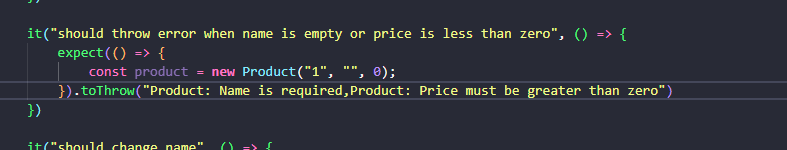
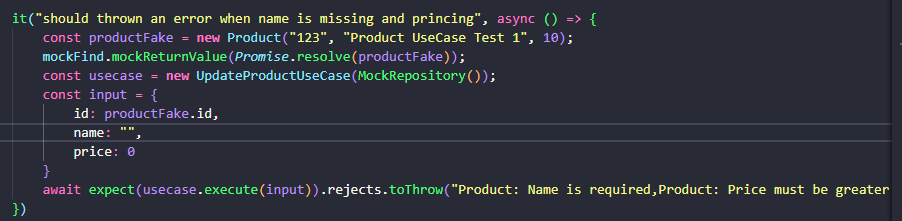

# Desafio Clean Architecture.

Nesse desafio foi feito toda a parte de CA.

### 1 - Criacao do UseCase para produtos.

### 2 - Camada de API de Produtos.

### 3 - Criacao do Notification Pattner.

### 4 - Criacao de classe para evitar "Acoplamento" nas validacoes.

# Correcoes

Nao sei se entendi bem o que foi "pedido", Mas a Notification Pattner para Product foi feito.

Deixei criei esses dois testes a mais e suas mudancas é claro.

**arquivo:src/domain/product/entity/product.spec.ts**

**arquivo: src/usecase/product/update/update.product.unit.spec.ts**

> caso tenha mais alguma coisa diferente do que foi passado, poderia informar no retorno por favor?